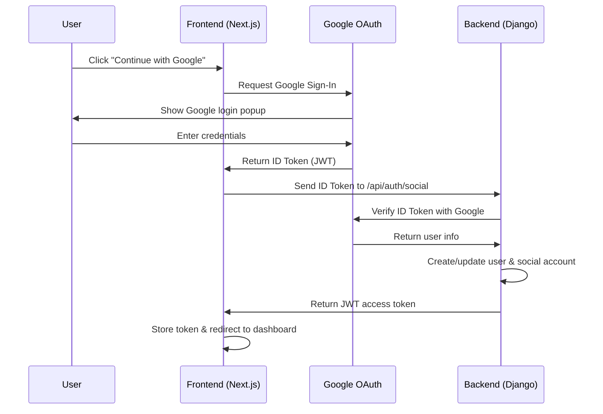

# Google OAuth Setup Guide

This guide explains how to set up Google OAuth authentication in your Django Ninja + Next.js application.

## 🏗️ Architecture Overview

Our Google OAuth implementation uses:
- **Frontend**: Next.js with Google Sign-In JavaScript library
- **Backend**: Django Ninja with custom JWT authentication
- **Flow**: Google ID Token → Django verification → JWT tokens



## 🔧 Setup Steps

### 1. Google Cloud Console Setup

1. **Create a Google Cloud Project**
   - Go to [Google Cloud Console](https://console.cloud.google.com/)
   - Create a new project or select existing one

2. **Enable Google+ API**
   - Navigate to "APIs & Services" → "Library"
   - Search for "Google+ API" or "Google Identity API"
   - Click "Enable"

3. **Create OAuth 2.0 Credentials**
   - Go to "APIs & Services" → "Credentials"
   - Click "Create Credentials" → "OAuth 2.0 Client IDs"
   - Choose "Web application"
   - Add these **Authorized JavaScript origins**:
     ```
     http://localhost:3000
     http://127.0.0.1:3000
     ```
   - Add these **Authorized redirect URIs**:
     ```
     http://localhost:3000
     http://127.0.0.1:3000
     ```
   - Click "Create"
   - Copy the **Client ID** and **Client Secret**

### 2. Environment Variables

#### Frontend (.env.local)
```bash
# Google OAuth Configuration
NEXT_PUBLIC_GOOGLE_CLIENT_ID=your_google_client_id_here

# API Configuration
NEXT_PUBLIC_API_BASE_URL=http://localhost:8000/api
```

#### Backend (.env.local)
```bash
# Google OAuth2 settings
GOOGLE_OAUTH2_CLIENT_ID=same_as_frontend_client_id
GOOGLE_OAUTH2_CLIENT_SECRET=your_google_client_secret_here

# Django settings
DEVELOPMENT_MODE=True
DJANGO_SECRET_KEY=your-secret-key-here
DJANGO_ALLOWED_HOSTS=127.0.0.1,localhost
CORS_ALLOWED_ORIGINS=http://localhost:3000,http://127.0.0.1:3000
CSRF_TRUSTED_ORIGINS=http://localhost:3000,http://127.0.0.1:3000
```

### 3. Backend Setup

#### Install Dependencies
```bash
cd backend
pip install django-allauth requests
```

#### Settings Configuration
The following is already configured in `backend/core/settings.py`:

```python
INSTALLED_APPS = [
    # ... other apps
    "django.contrib.sites",
    "allauth",
    "allauth.account",
    "allauth.socialaccount",
    "allauth.socialaccount.providers.google",
]

SITE_ID = 1

AUTHENTICATION_BACKENDS = [
    'django.contrib.auth.backends.ModelBackend',
    'allauth.account.auth_backends.AuthenticationBackend',
]

# Google OAuth2 settings
GOOGLE_OAUTH2_CLIENT_ID = getenv('GOOGLE_OAUTH2_CLIENT_ID')
GOOGLE_OAUTH2_CLIENT_SECRET = getenv('GOOGLE_OAUTH2_CLIENT_SECRET')
```

#### Run Migrations
```bash
python manage.py migrate
```

### 4. Frontend Setup

The Google Sign-In button is already integrated into your login and signup forms. It automatically:
- Loads Google's JavaScript library
- Renders the official Google Sign-In button
- Handles the OAuth flow
- Sends the ID token to your backend

## 🔄 Authentication Flow

### Step 1: User Clicks Google Sign-In
```javascript
// GoogleSignInButton component handles this automatically
window.google.accounts.id.initialize({
    client_id: process.env.NEXT_PUBLIC_GOOGLE_CLIENT_ID,
    callback: handleCredentialResponse,
});
```

### Step 2: Google Returns ID Token
```javascript
const handleCredentialResponse = (response) => {
    // response.credential contains the JWT ID token
    socialAuth.mutate({
        body: {
            credential: response.credential,
            provider: "google",
        },
    });
};
```

### Step 3: Backend Verifies Token
```python
# In SocialAuthService.authenticate_with_google()
response = requests.get(
    f'https://www.googleapis.com/oauth2/v3/tokeninfo?id_token={credential}'
)
token_info = response.json()

# Verify token audience
if token_info.get('aud') != settings.GOOGLE_OAUTH2_CLIENT_ID:
    raise APIException(detail="Invalid token audience")
```

### Step 4: Create/Update User
```python
# Extract user info from Google token
user_data = {
    'id': token_info.get('sub'),
    'email': token_info.get('email'),
    'given_name': token_info.get('given_name', ''),
    'family_name': token_info.get('family_name', ''),
}

# Create or get existing user
user = User.objects.get_or_create(email=email, defaults={...})

# Create social account link
SocialAccount.objects.create(
    user=user,
    provider='google',
    uid=user_data.get('id'),
    extra_data=user_data
)
```

### Step 5: Return JWT Tokens
```python
# Generate JWT tokens for the user
refresh = RefreshToken.for_user(user)
return {
    'access': str(refresh.access_token),
    'refresh': str(refresh)
}
```

## 🔐 Security Features

### Token Verification
- **ID Token Validation**: Verifies token with Google's servers
- **Audience Verification**: Ensures token is for your application
- **Expiration Checking**: Google handles token expiration

### User Data Protection
- **Minimal Data Storage**: Only stores necessary user information
- **Social Account Linking**: Tracks which accounts are linked to Google
- **Email Verification**: Uses Google's email verification status

### JWT Security
- **HttpOnly Cookies**: Refresh tokens stored in secure cookies
- **CORS Protection**: Configured for your specific domains
- **Token Rotation**: Automatic token refresh mechanism

## 🛠️ API Endpoints

### POST /api/auth/social
Authenticates user with social provider credentials.

**Request:**
```json
{
    "credential": "google_id_token_here",
    "provider": "google"
}
```

**Response:**
```json
{
    "detail": "Authentication successful",
    "access": "jwt_access_token"
}
```

**Headers:**
- Sets `refresh` token in HttpOnly cookie

## 🐛 Troubleshooting

### Common Issues

#### 1. "The given origin is not allowed"
**Solution**: Add your exact URL to Google Cloud Console authorized origins:
- Go to Google Cloud Console → Credentials
- Edit your OAuth 2.0 Client ID
- Add `http://localhost:3000` to Authorized JavaScript origins

#### 2. "Invalid token audience"
**Solution**: Ensure your Client ID matches in both frontend and backend:
- Check `NEXT_PUBLIC_GOOGLE_CLIENT_ID` in frontend
- Check `GOOGLE_OAUTH2_CLIENT_ID` in backend

#### 3. "CORS headers" error
**Solution**: Verify your CORS settings in Django:
```python
CORS_ALLOWED_ORIGINS = [
    "http://localhost:3000",
    "http://127.0.0.1:3000",
]
```

#### 4. Google button not loading
**Solution**: Check browser console for errors:
- Ensure Client ID is set correctly
- Try clearing browser cache
- Test in incognito mode

### Debug Mode
The Google Sign-In button includes debug logging. Check browser console for:
- `🔍 Debug Info:` - Shows configuration
- `✅ Google script loaded` - Confirms Google library loaded
- `🎉 Google credential received` - Shows successful authentication

## 🚀 Production Deployment

### Frontend
1. Update authorized origins in Google Cloud Console:
   ```
   https://yourdomain.com
   ```

2. Update environment variables:
   ```bash
   NEXT_PUBLIC_GOOGLE_CLIENT_ID=your_client_id
   NEXT_PUBLIC_API_BASE_URL=https://api.yourdomain.com/api
   ```

### Backend
1. Update Django settings:
   ```python
   ALLOWED_HOSTS = ['api.yourdomain.com']
   CORS_ALLOWED_ORIGINS = ['https://yourdomain.com']
   ```

2. Use secure environment variables:
   ```bash
   GOOGLE_OAUTH2_CLIENT_SECRET=your_secret_from_env
   ```

## 📚 Additional Resources

- [Google Identity Documentation](https://developers.google.com/identity/gsi/web)
- [Django Allauth Documentation](https://django-allauth.readthedocs.io/)
- [Django Ninja JWT Documentation](https://django-ninja-jwt.readthedocs.io/)

## 🔄 Extending to Other Providers

To add Facebook, GitHub, or other providers:

1. **Add provider to Django settings:**
   ```python
   INSTALLED_APPS = [
       # ... existing apps
       "allauth.socialaccount.providers.facebook",
   ]
   ```

2. **Update the frontend schema:**
   ```typescript
   // Update SocialAuthSchema to accept other providers
   provider: "google" | "facebook" | "github"
   ```

3. **Add provider handling in backend:**
   ```python
   if data.provider == "facebook":
       user = SocialAuthService.authenticate_with_facebook(data.credential)
   ```

The architecture is designed to be easily extensible for multiple OAuth providers.